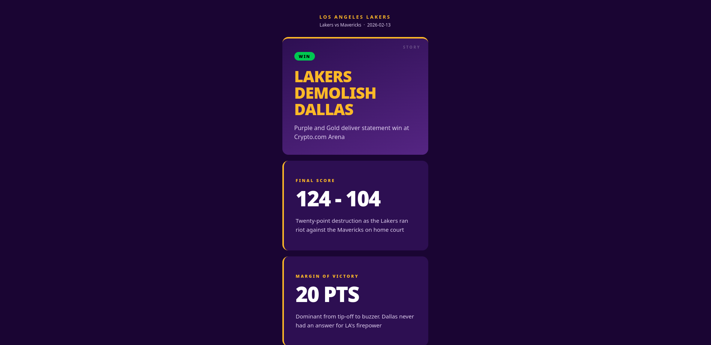
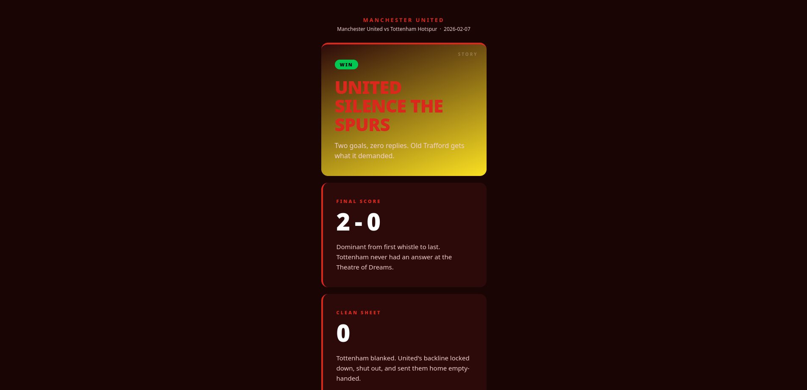

# Sports Stories Generator

An AI-powered command-line tool that fetches live sports match data and automatically generates Instagram/Snapchat-style Story content — complete with a styled HTML preview. Built with Python, the Anthropic Claude API, and TheSportsDB.

> **Target teams:** Manchester United (Premier League) · LA Lakers (NBA)

---

## What It Does

Running a single command prompts you to choose a team. The tool then:

1. **Fetches the most recent match result** from TheSportsDB's free API
2. **Sends the match data to Claude** with a structured prompt engineered to produce punchy, on-brand social copy
3. **Validates and saves the output** as a clean JSON file — the kind of payload a real mobile app or CMS would consume
4. **Renders a styled HTML preview** that looks like an actual Stories feed card, using official team colours

From terminal command to browser-ready Story cards in under 15 seconds.

---

## Preview

### LA Lakers — Win vs Dallas Mavericks



### Manchester United — Win vs Tottenham Hotspur



---

## Why This Project Exists

Sports media is increasingly delivered in short-form, visual formats — Instagram Stories, Snapchat, LinkedIn Stories, and emerging B2B equivalents used by clubs, broadcasters, and betting platforms to engage fans between fixtures.

The bottleneck isn't design — it's **content generation at scale**. A media team covering 10 teams across 3 competitions can't manually write Story copy for every match. This project demonstrates a working proof-of-concept for automating that pipeline:

- Structured data in → validated, publication-ready content out
- Output is JSON-first, making it directly consumable by a mobile app, CMS, or design tool
- The HTML preview serves as a lightweight stakeholder demo without requiring a front-end build

This is the kind of tooling that sits behind a B2B SaaS Stories platform — the layer that turns a database row into fan-facing content.

---

## Technical Architecture

The project is built on a strict **separation of concerns**: each component has one job and knows nothing about the others. This makes every module independently testable and replaceable.

```
[ TheSportsDB API ] ──► [ sports_fetcher.py ]
                                │
                                ▼
                       [ prompt_builder.py ]
                                │
                                ▼
                       [ Anthropic Claude API ]
                                │
                                ▼
                        [ claude_client.py ]
                                │
                                ▼
                        [ story_parser.py ] ──► output/{team}_story.json
                                │
                                ▼
                       [ html_renderer.py ] ──► output/{team}_story.html
```

### Component Breakdown

| File | Responsibility | Key Concept |
|---|---|---|
| `sports_fetcher.py` | Fetches and normalises match data from TheSportsDB | Data access layer, API error handling |
| `prompt_builder.py` | Transforms match data into a structured Claude prompt | Prompt engineering, RAG pattern |
| `claude_client.py` | Sends the prompt to Claude and returns the raw response | Anthropic SDK, token management |
| `story_parser.py` | Validates Claude's JSON output and writes it to disk | Defensive parsing, schema validation |
| `html_renderer.py` | Renders Story cards as a self-contained HTML file | Presentation layer, team theming |
| `main.py` | Orchestrates the pipeline and handles user input | CLI design, graceful error handling |

---

## Key Technical Decisions

### Why TheSportsDB?

It covers both football and basketball under a single free API with no credit card required, returns the last 5 events per team, and uses simple unauthenticated GET requests. The tradeoff is data richness — it lacks per-player stats or expected goals. For a Story generator, match result, score, venue, and margin are sufficient.

### Why JSON output first, HTML second?

In a real product, the JSON would be the deliverable — consumed by a mobile app, a Figma plugin, or a headless CMS. The HTML is a preview layer for demos and development. Separating them means the core output is immediately useful in a production context without front-end infrastructure.

### Why structure the prompt as persona + task + format?

This is the most reliable prompting pattern for consistent structured output. The **persona** shapes Claude's vocabulary and tone. The **task** specifies slide count, per-result tone guidance (a WIN Story should feel different from a LOSS), and content constraints. The **format** block shows the exact JSON schema with field names — acting as a typed contract between the AI layer and the parser. Without the format block, Claude produces excellent prose that breaks `json.loads()`.

### Why separate `prompt_builder.py` from `claude_client.py`?

In a real product you'd A/B test prompts — different tones, slide counts, personas. Keeping prompt logic separate from API call logic means you can iterate on one without touching the other. It also means swapping Claude for a different model requires changing only `claude_client.py`.

### Why defensive parsing in `story_parser.py`?

Claude's output is almost always valid JSON — but almost isn't good enough for a reliable tool. The parser strips markdown code fences (which Claude occasionally produces despite instructions), removes preamble text, and validates every required field per slide type before writing to disk. This is the difference between a demo that works in testing and a tool that works every time.

---

## Project Structure

```
sports-stories-generator/
├── .env                    # API key — never committed to git
├── .gitignore
├── requirements.txt
├── README.md
│
├── main.py                 # Entry point and orchestrator
├── sports_fetcher.py       # TheSportsDB API layer
├── prompt_builder.py       # Prompt engineering layer
├── claude_client.py        # Anthropic API layer
├── story_parser.py         # Validation and persistence layer
├── html_renderer.py        # Presentation layer
│
├── screenshots/            # Preview images for README
│   ├── lakers_preview.png
│   └── manutd_preview.png
│
└── output/                 # Generated files (git-ignored)
    ├── lakers_story_20260217_143022.json
    ├── lakers_story_20260217_143022.html
    ├── manutd_story_20260217_143041.json
    └── manutd_story_20260217_143041.html
```

---

## Getting Started

### Prerequisites

- Python 3.9+
- An [Anthropic API key](https://console.anthropic.com) (paid credits required — approximately $0.002 per run)

### Installation

```bash
# Clone the repository
git clone git@github.com:Asani-A/sports-stories-generator.git
cd sports-stories-generator

# Create and activate a virtual environment
python3 -m venv venv
source venv/bin/activate  # Windows: venv\Scripts\activate

# Install dependencies
pip install -r requirements.txt
```

### Configuration

Create a `.env` file in the project root:

```
ANTHROPIC_API_KEY=sk-ant-your-key-here
```

Your API key is loaded via `python-dotenv` and never touches source control — `.env` is listed in `.gitignore`.

### Usage

```bash
python main.py
```

You'll be prompted to select a team:

```
=======================================================
  🏆  SPORTS STORIES GENERATOR
  Powered by TheSportsDB + Claude AI
=======================================================

Select a team to generate a Story for:

  [1]  Manchester United
       ⚽ Football (Premier League)

  [2]  LA Lakers
       🏀 Basketball (NBA)

  [3]  Both teams
       Run full pipeline for both

Enter your choice (1/2/3):
```

Output files are written to `output/` with a timestamp so successive runs don't overwrite each other. The tool optionally opens the HTML preview in your default browser on completion.

---

## Sample Output

### JSON (`output/lakers_story_20260213.json`)

```json
{
  "team": "Los Angeles Lakers",
  "match": "Los Angeles Lakers vs Dallas Mavericks",
  "date": "2026-02-13",
  "result": "WIN",
  "slides": [
    {
      "type": "headline",
      "text": "LAKERS DEMOLISH DALLAS",
      "subtext": "Purple and Gold dominate at Crypto.com Arena with statement victory"
    },
    {
      "type": "stat",
      "stat_label": "FINAL SCORE",
      "stat_value": "124 - 104",
      "narrative": "Twenty-point blowout sends the Mavericks packing from downtown LA in brutal fashion."
    },
    {
      "type": "stat",
      "stat_label": "MARGIN OF VICTORY",
      "stat_value": "20 PTS",
      "narrative": "Complete control from tip-off as the Lakers never let Dallas sniff a comeback."
    },
    {
      "type": "cta",
      "text": "@LakersNation",
      "subtext": "Follow for exclusive highlights and postgame reaction 💜💛"
    }
  ]
}
```

---

## Concepts Demonstrated

**For a technical interviewer:**

- REST API consumption with proper error handling (timeouts, status codes, encoding edge cases)
- Prompt engineering — persona, task, format separation; tone branching by match result
- Retrieval-Augmented Generation (RAG) — real data fetched first, passed to the model as context
- Defensive AI output parsing — code-fence stripping, brace extraction, per-field schema validation
- Separation of concerns across six single-responsibility modules
- Secrets management with `.env` and `.gitignore`
- CLI design with validation loops and graceful per-team error isolation

**For a non-technical reader:**

This tool does in 15 seconds what would take a social media manager 10–15 minutes per match: research the result, find the key stats, write punchy copy in the right tone for that result, and format it for a Stories feed. Multiply that by a league season — 38 matches for a Premier League club, 82 for an NBA team — and the value of automation becomes clear. The output is structured data, not just text, which means it plugs directly into any app or platform without manual reformatting.

---

## Extending the Project

The architecture is designed to be extended without restructuring:

- **Add a new team:** one new entry in `TEAM_CONFIG` in `sports_fetcher.py` and `TEAMS` in `main.py`
- **Add a new slide type:** one new renderer in `html_renderer.py` and a new validation rule in `story_parser.py`
- **Change the AI model:** one line in `claude_client.py`
- **Change the tone or style:** edit `prompt_builder.py` only
- **Add a new sport:** the pipeline is sport-agnostic; TheSportsDB covers NFL, MLB, cricket, and more

---

## Dependencies

| Package | Purpose |
|---|---|
| `anthropic` | Official Anthropic Python SDK for Claude API access |
| `requests` | HTTP client for TheSportsDB API calls |
| `python-dotenv` | Loads `.env` file into environment variables |

All other imports (`os`, `json`, `re`, `sys`, `webbrowser`, `datetime`, `glob`) are Python standard library.

---

## Cost

Each full pipeline run makes two external API calls:

- **TheSportsDB:** free, no rate limit concerns at this usage level
- **Anthropic Claude:** approximately 800–900 input tokens + 250–300 output tokens per team. At current Sonnet pricing this is roughly **$0.001–$0.002 per team** — under half a cent. Running both teams costs less than $0.005.

A $5 credit balance is sufficient for hundreds of development runs.

---

## License

MIT — see `LICENSE` for details.

---

*Built as a portfolio project demonstrating AI API integration, prompt engineering, and data pipeline design in Python.*
